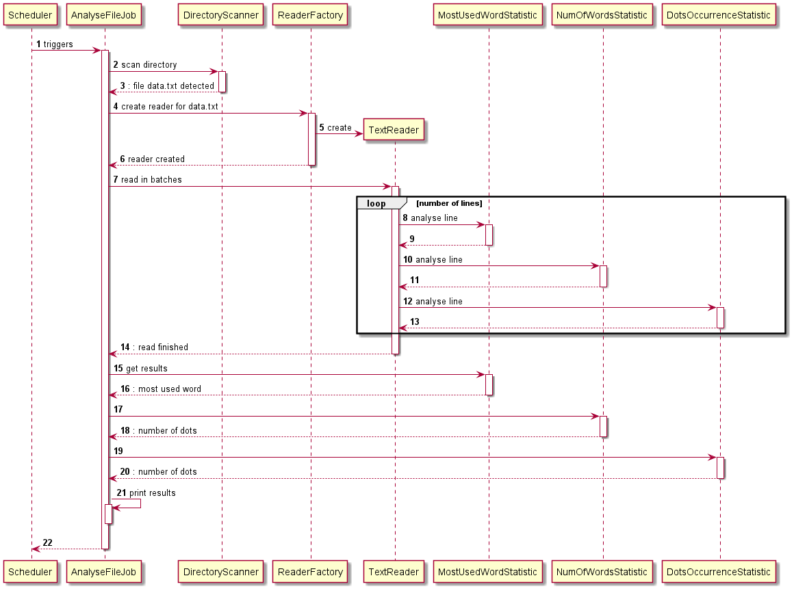
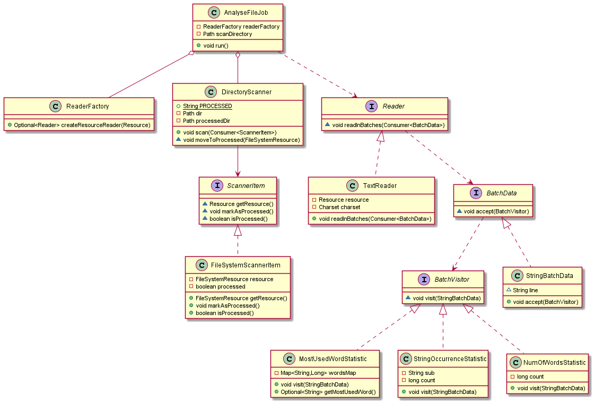

# General
This application generates statistic for supported files (.txt) from requested directory.

Generated statistic:
- Number of words
- Number of dots
- Most used word in file

After analyse file is moved to 'processed' directory
Large files are supported (read line by line)

# Usage
Java 14 is required to run application
```
java -jar hicx.jar --scan.directory=<scanDirectory>
```
--scan.directory - is path to root directory with your files to scan
--scan.fixed-delay - (optional, default 1000) time in milis between directory scan

### Example
```
java -jar hicx.jar --scan.directory=/data/files
```
Will scan /data/files directory and try to analyze if supported

# Contribution
Project is written in Java 14, Spring Boot 2.6.3 with Maven 3+

### Compilation
```
mvn clean install
```

## Diagrams
Sequence diagram

Class diagram


# Implementation details
To add new file support (like PdfReader) you have to implement [Reader](src/main/java/com/hicx/reader/Reader.java) and register it in [ReaderFactory](src/main/java/com/hicx/reader/ReaderFactory.java)

To add new statistic you have to implement [Statistic](src/main/java/com/hicx/stat/Statistic.java) and register it in[AnalyseFileJobConfiguration](src/main/java/com/hicx/job/AnalyseFileJobConfiguration.java)

Visitor pattern is used to generate Statistic. Each text line is passed to visit method.
