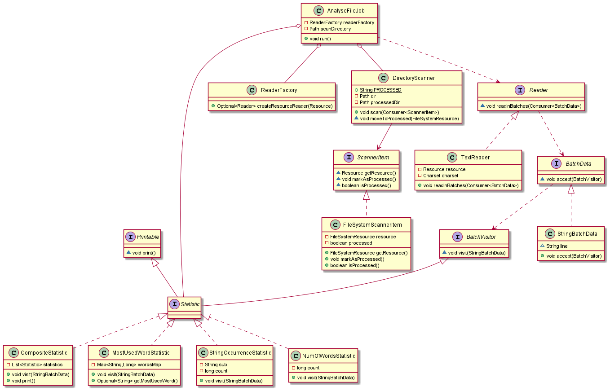

# General
This application generates statistic for supported files (.txt) from requested directory.

Generated statistic:
- Number of words
- Number of dots
- Most used word in file

After analyse file is moved to 'processed' directory

# Usage
Java 14 is required to run application
```
java -jar hicx.jar --scan.directory=<scanDirectory>
```
--scan.directory - is path to root directory with your files to scan
### Example
```
java -jar hicx.jar --scan.directory=/data/files
```
Will scan /data/files directory and try to analyze if supported

# Contribution
Project is written in Java 14, Spring Boot 2.6.3 with Maven 3+

### Compilation
```
mvn clean install
```

## Diagrams
Sequence diagram

Class diagram


### Class
AnalyseFileJob - it has run() method triggered by scheduler every X seconds
